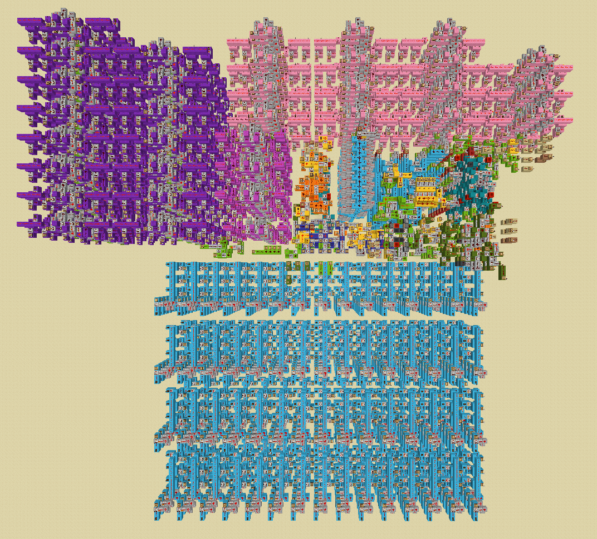

# Minecraft CPU
CPU architecture built using Minecraft redstone and the Create mod, along with an assembler written in Python to convert assembly language code into machine code. It uses redstone signal strength (0-15) to store hexadecimal values. From the Create mod I used the Analog Lever to allow adjustable signal strength for programming, and the Redstone Link to allow signals to be sent wirelessly; the rest of the build is using vanilla redstone circuits.

\
\
\

## Architecture
The CPU uses Harvard architecture, with separate instruction and data memory. Data memory currently consists of 60 cells, of size 1 byte. Instruction memory consists of 30 cells, of size 2 bytes. There are 15 general purpose registers, as well as an expandable "secondary storage", which consists of blocks of 15 instructions at a time. The player specifies the start and end block of a given program, and presses a button to start execution. Demand paging is used to load blocks into instruction memory, which consists of 2 page frames.

## Instruction Set
The instruction set of the CPU and the instruction set accepted by the assembler are different. The CPU uses load-store architecture, whereas the assembler accepts immediate addressing modes and converts this into a form accepted by the CPU. I also programmed the assembler to accept more variety in branch instructions.\
The assembler takes in a text file with instructions written one per line. It replaces any immediate operands with a register reference, adding new load instructions if necessary. It also converts branches to one of the two types accepted by hardware. A converted version of assembly language is printed to console, and the machine code is written to a new text file at "original name"_converted.txt.

### Instruction Set Accepted by Assembler:
- op1, op2, etc. refers to operands that should be either: Rx (a.k.a the value in Register number x) or #x (immediate integer value x (base 10)).
- Labels should be used before an instruction, for example, loop: ADD R1, R2, R3.
- Example programs can be seen in the programs folder.

ADD R1, op1, op2        - Adds values from op1 and op2, storing result in R1\
SUB R1, op1, op2        - Subtracts op2 from op1, storing result in R1\
AND R1, op1, op2        - Performs bitwise AND on op1 and op2, storing result in R1\
OR R1, op1, op2         - Performs bitwise OR on op1 and op2, storing result in R1\
LS R1, op1              - Performs bitwise left shift on op1, storing result in R1\
RS R1, op1              - Performs bitwise right shift on op1, storing result in R1\
LD R1, op1              - Loads value from data memory, pointed to by op1, then stores it in R1\
LDI R1, #32             - Loads constant 32 (base 10), storing in R1\
STR R1, op1             - Writes value in R1 to data memory, at the address pointed to by op1\
BRU label               - Branches unconditionally to instruction at label\
BRE label, op1, op2     - Branches to instruction at label if op1 == op2\
BRLT label, op1, op2    - Branches to instruction at label if op1 < op2\
BRGT label, op1, op2    - Branches to instruction at label if op1 > op2\
BRZ label, op1          - Branches to instruction at label if op1 == 0

### Instruction Set Accepted by CPU Hardware
ADD R1, R2, R3      - Adds values from R2 and R3, storing result in R1\
SUB R1, R2, R3      - Subtracts the value in R3 from the value in R2, storing result in R1\
AND R1, R2, R3      - Performs bitwise AND on values in R2 and R3, storing result in R1\
OR R1, R2, R3       - Performs bitwise OR on values in R2 and R3, storing result in R1\
LS R1, R2           - Performs bitwise left shift on the value in R2, storing result in R1\
RS R1, R2           - Performs bitwise right shift on the value in R2, storing result in R1\
LD R1, R2           - Loads value from data memory, pointed to by the value in R2, then stores it in R1\
LDI R1, #32         - Loads constant 32 (base 10), storing in R1\
STR R1, R2          - Writes value in R1 to data memory, at the address pointed to by the value in R2\
BRE R1, R2, R3      - Branches to instruction at address pointed to by value in R1 if value in R2 == value in R3\
BRLT R1, R2, R3     - Branches to instruction at address pointed to by value in R1 if value in R2 < value in R3

## Schematics
The python script schematic_generator.py converts machine code text files to a schematic that can be used by the WorldEdit mod to spawn in the whole program at once, in the form of barrels with various redstone signal strengths. This increases efficiency in testing out programs, as they can be written into the world immediately. To use, run the script on the terminal with the name of the machine code file (omitting the .txt) as an argument. This produces a .schem file in the schematics folder, which can be transferred into the WorldEdit folder in the Minecraft folder to load it into the world.